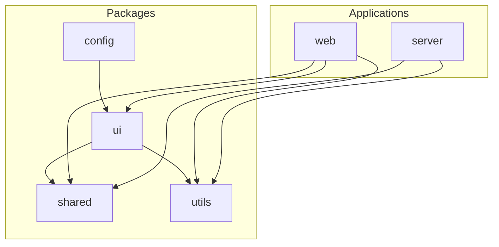

# EUNOIA OS Architecture Design Document

This document describes the architectural framework, project boundaries, design patterns, and operational practices chosen for **EUNOIA OS**.

---

## 🏛️ Monorepo Design & Workspace Strategy

EUNOIA OS utilizes **npm workspaces** to manage multiple packages under a single git repository. 



### Core Workspace Packages

1. **`packages/config`**
   * *Purpose:* Shared infrastructure configurations.
   * *Exports:* Shareable configurations for Tailwind CSS and ESLint presets.
   * *Design Goal:* Centralizes project-wide style bases and formatting rules so that changes in design system metrics or standards apply universally across apps.

2. **`packages/ui`**
   * *Purpose:* Shared component design system.
   * *Dependencies:* `clsx`, `tailwind-merge`.
   * *Exports:* Core atomic components and the classnames utility `cn()`.
   * *Design Goal:* Strict separation of concerns. This package contains *zero* business logic, *zero* data-fetching, and *zero* app state. It strictly houses presentation layer design patterns.

3. **`packages/utils`**
   * *Purpose:* Global JavaScript logic utilities.
   * *Exports:* Time manipulation/delays (`sleep`), string cleanups, formatting engines, math functions.
   * *Design Goal:* Prevents utility duplication between frontend clients and Express database servers.

4. **`packages/shared`**
   * *Purpose:* Constants, structures, models, validations.
   * *Exports:* User roles, state schemas, status code constants, base endpoint paths.
   * *Design Goal:* Ensures single-source-of-truth constants. Modifying database state mappings (e.g. TaskStatus enums) propagates to React views and server schemas automatically.

---

## 🎨 Frontend Architecture (`apps/web`)

The React application uses a **Feature-Based Architecture**. By isolating views and logic under modular feature buckets, scaling the app becomes linear.

### Core Architecture Columns

```
apps/web/src/
├── app/            # App Shell (routing, providers, layouts, global stores)
├── features/       # Modular features (dashboard, twin, goals, assistant, etc.)
│   ├── dashboard/
│   │   ├── components/  # Feature-specific components
│   │   ├── hooks/       # Feature-specific state/data-fetching hooks
│   │   └── index.js     # Clean public API export interface
├── components/     # Global layout components and UI re-exports
└── services/       # Core HTTP layer client wrappers (Axios, AI)
```

### Key Practices:
* **The `features/` Public Interface:** Each module folder inside `features/` has an `index.js` which defines its public export. Files *outside* the feature module (like layouts or routers) must *only* import from this root `index.js`. Internal folder structures remain hidden from the rest of the application.
* **Component Classification:** Custom components reside at the feature level first. They are promoted to the global `components/` directory only when they are reused across two or more distinct features.
* **Service Client Wrappers:** Core external logic is encapsulated inside `services/`. The Axios config, response interceptors, and Gemini AI connectors remain isolated here, shielding feature views from implementation detail changes.

---

## ⚙️ Backend Architecture (`apps/server`)

The backend is built around a **Modular Controller/Router** design. It splits concerns into structural framework modules (`core/`) and functional route packages (`modules/`).

```
apps/server/src/
├── core/           # Core framework (middleware, configs, DB adapters, error/logging)
├── modules/        # Feature routers (dashboard, twin, goals, assistant, etc.)
└── routes/         # Central API route mounting index
```

### Key Practices:
* **Global Error Middleware:** Uncaught exceptions are handled at the very end of the routing chain via the global `errorHandler` middleware. This keeps route handler code clean, avoiding complex `try-catch` structures inside each API path handler.
* **Unified Prisma Adapter:** The Prisma connection client is instantiated and exported exactly once inside `core/database/index.js`, using standard pooled connection structures.
* **Central API Routing Registry:** The `routes/index.js` file mounts all feature modules under appropriate versioned namespace prefixes (`/api/v1/auth`, `/api/v1/twin`, etc.). The app entrypoint imports a single router module.

---

## 🛡️ Quality Gateways & Security

1. **Pre-commit Quality Checks:**
   Husky and lint-staged check all modified files before they are written to history. Staged files are run through ESLint (`eslint --fix`) and Prettier (`prettier --write`).
2. **ESLint Flat Config System:**
   Uses modern flat configurations allowing workspace-level rule extensions (e.g. extending Browser environments for React, Node environments for Express) while sharing common code-quality rules.
3. **Helmet Security Headers:**
   The Express server incorporates `helmet()` to automatically configure standard headers (HSTS, CSP, Clickjacking protection).
